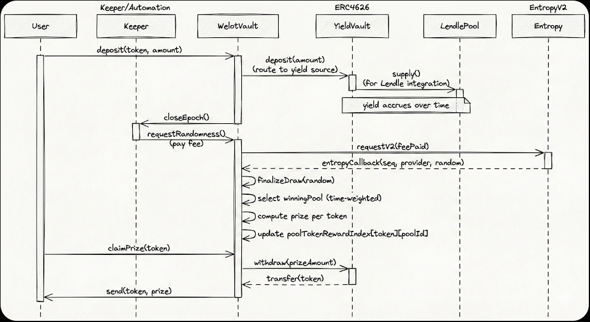

# WeLot

No-loss savings lottery on Mantle: deposit into yield sources, get a chance to win the yield, and keep your principal withdrawable.



This README focuses on protocol understanding and high-level behavior first. Setup and quickstart instructions are provided at the bottom.

## How protocol works

- Users deposit supported ERC-20 tokens into the vault; deposits are routed into per-token ERC-4626 yield sources (e.g., `LendleYieldVault`).
- Pools: users are deterministically assigned to a fixed pool at deploy; deposits are tracked per-token, per-pool.
- Yield accrues inside the ERC-4626 adapters; surplus (assets above liabilities) becomes the prize pool.
- Epoch lifecycle: `Open` → `Closed` → `RandomnessRequested` → `RandomnessReady` → `finalizeDraw()`.
  - Operator/keeper calls: `closeEpoch()` → `requestRandomness()` → wait for `entropyCallback(...)` → `finalizeDraw()`.
- Winner selection: `finalizeDraw()` uses a time-weighted pool selection (weights ≈ integral of normalized pool balance) to pick a winning pool.
- Prize accounting: for each token, prize = max(totalAssets - (totalDeposits + totalUnclaimedPrizes), 0). Winners receive per-token reward indices updated pro-rata within the winning pool.
- Claiming: winners call `claimPrize(token)` (or `claimPrizeFrom(token,poolId)` when allowed) — vault withdraws from the ERC-4626 source and transfers tokens to the user.
- Automation: `checkUpkeep` / `performUpkeep` support common keeper flows; see `frontend/scripts/keeper.mjs` for examples.

## Repo overview & key components

- `contracts/` — Foundry project
  - `src/WelotVault.sol` — core contract
  - `script/DeployLocal.s.sol` — local deployment (mocks + faucet)
  - `script/DeployMantle.s.sol` — Mantle mainnet/testnet deployment
  - `script/RunDraw.s.sol` — helper for mock-entropy draws
- `frontend/` — Next.js app (reads `NEXT_PUBLIC_*` config)

### On-chain highlights

- `WelotVault` manages supported tokens, user deposits (per pool), epoch lifecycle, randomness, and prize accounting.
- Yield sources must be ERC-4626 compliant; Lendle integration is via `LendleYieldVault` (ERC4626 adapter).
- Randomness is provided asynchronously by Entropy V2 (requestV2 / entropyCallback).
- Pools are fixed and users are deterministically assigned to a pool at deployment.

### addresses on mantle testent
NEXT_PUBLIC_CHAIN_ID=5003
NEXT_PUBLIC_RPC_URL=

NEXT_PUBLIC_WELOT_VAULT=0x3A43e42cE9Fa6318C167C506112de9082BdDF703 (main)
NEXT_PUBLIC_ENTROPY=0x98046Bd286715D3B0BC227Dd7a956b83D8978603
NEXT_PUBLIC_FAUCET=0x3182189E8aA11778e9761679a77215eF3deB4b19

NEXT_PUBLIC_USDC=0xFD2a64348c829Da9e9CE3f688910909ecF6F384A
NEXT_PUBLIC_SUSDC=0x9fc2a8a2F28478f7575bF13E854f61699439EF70
NEXT_PUBLIC_USDT=0x53779f445FBCFB52A9bA5aC246969d2D2902b710
NEXT_PUBLIC_SUSDT=0x384F87AC9e01ab2bF061474771f1B06b4922F38d

## Docs

- `PROTOCOL.md` — protocol/contract behavior (authoritative)
- `TESTNET_TESTING.md` — Mantle Sepolia testing + keeper notes
- `contracts/README.md` — Foundry workflows
- `frontend/README.md` — UI + keeper workflows

## Repo contents

- Solidity contracts (Foundry) in `contracts/`
- A Next.js frontend in `frontend/`
- Protocol and testnet notes in `PROTOCOL.md` and `TESTNET_TESTING.md`

---

## Quickstart (local)

### 1) Start a local chain

```bash
anvil
```

### 2) Deploy the local stack

```bash
cd contracts
forge script script/DeployLocal.s.sol:DeployLocalScript --rpc-url http://127.0.0.1:8545 --broadcast
```

The script prints `NEXT_PUBLIC_*` values for the UI.

### 3) Configure + run the frontend

```bash
cd frontend
---

## Setup (short)

Setup and deployment instructions are intentionally brief here. For full, step-by-step guides consult the per-folder READMEs:

- [contracts/README.md](contracts/README.md) — Foundry, local deploy, and testnet deploys
- [frontend/README.md](frontend/README.md) — UI setup, environment variables, and keeper scripts

If you just want to run the dev frontend quickly (convenience):

```bash
npm run dev
```
- Foundry also writes a JSON receipt under `contracts/broadcast/DeployMantle.s.sol/5003/run-latest.json`.
